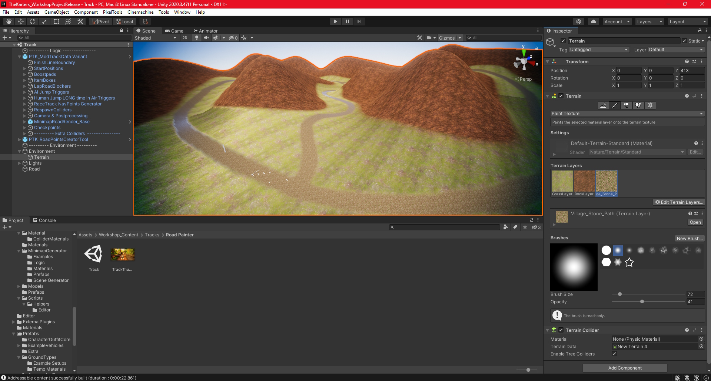
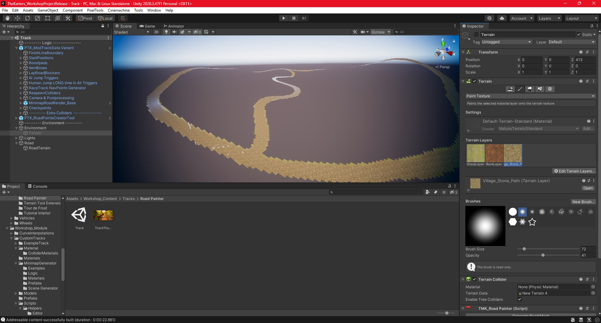
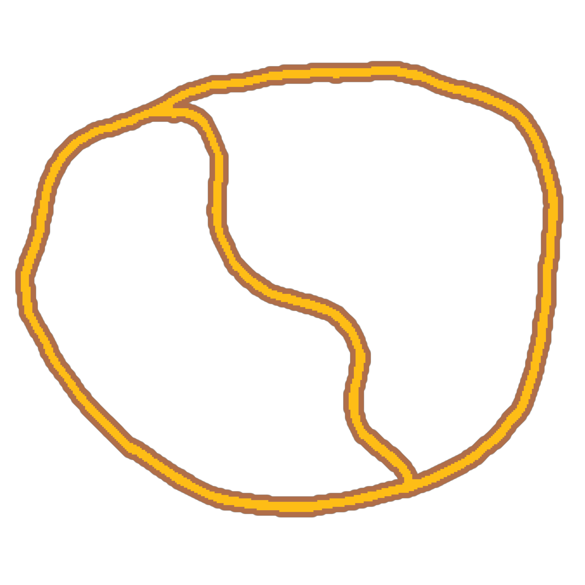

# Road Painter
The road painter tool allows you to draw textures on a terrain to define what is a normal road and what is offroad. The tool will create two separate terrains for the road and offroad, but any collision properties must be applied manually within Unity.

The following instructions give a very basic idea of how to use the tool, and it assumes you just work with whatever terrain you end up making. You can be more intentional in your terrain design and change the order of some of the steps if desired.

## Instructions
1. Add a `Terrain` object to your Unity scene under the `Environment` object.
1. In the terrain settings, adjust your width, length, height, etc.
    1. The default length and width of a terrain is 1000x1000. Four default terrains in a square seems to provide a decent size to work with, but it's easier to use the scripts with one terrain set to a size of 2000x2000.
1. Apply a base texture with the `Paint Texture` tool to serve as the default offroad texture.
    1. Either add an existing `Terrain Layer` or create a new one.
1. Raise and lower the terrain until you're satisfied with the result.
1. Add another `Terrain Layer` with the texture you want to use for your road.
1. Use the `Paint Texture` tool to draw your road. A brush size of ~72 is just large enough to fit all the starting positions with the default spacing.
1. Make any final terrain adjustments since it's easier to do that before the road terrain is generated.
1. Before moving on, you should have a scene that looks something like the following.

1. Add the [TMK_RoadPainter.cs](./TMK_RoadPainter.cs) script to your terrain.
1. Under the script options in `Road Texture Indexes`, select the indexes of your road textures where the first texture in your terrain is 0.
    1. In the screenshot above, the village stone path texture is being used as the road, so index 2 should be used as `Element 0`.
    1. If you have multiple road textures, you can add more texture indexes to the list.
1. The `Texture Threshold` and `Max Distance From Road To Preserve Points` options can be adjusted to change the road terrain generation, but the defaults should be hopefully be sufficient for most use cases.
1. Press the `Generate Road Mesh` button, and wait for the script to finish running.
1. Expand the `Terrain`'s children, and you should see a new `Terrain` called `RoadTerrain`. Drag this to the `Road` object.
1. If you disable the original `Terrain`, you can see the new terrain that was generated for the road.

1. If you need to make any adjustments to the terrain height or road path, delete the `RoadTerrain` object, and in the original `Terrain`, press the `Reset Holes` button. At this point, you can make any adjustments and then regenerate the `RoadTerrain`.
1. For both the `Terrain` and `RoadTerrain`, set the layer to `GroundCollider`.
1. For the `Terrain`, add the `PTK_Ground Type` script to set the friction type to one of the offroad types.
1. Other than generating the minimap (which will be covered in it's own section), you can proceed to create the track like normal. Set start positions, add track decorations, etc.

## Minimap Generator Instructions
The terrain cannot be used directly for the minimap due to texturing issues. To mitigate this, a plane is created in the same shape as the road terrain, and that plane can be used as the minimap geometry.

1. Add the [TMK_MinimapPlaneGenerator.cs](./TMK_MinimapPlaneGenerator.cs) script to your `RoadTerrain`.
1. Under the `Terrains` list, add one element, and drag your `RoadTerrain` into the list. If you have multiple road terrains, you can add all of them to the list.
1. Press `Generate Road Planes` and wait for the script to finish.
1. Expand the `RoadTerrain`'s children, and you should see a plane called `TerrainMap`. Drag this to the object where models for the minimap are to be placed according to the TK2 modding SDK wiki.
1. Add the minimap road texture to the plane.
1. Generate a minimap the same way a normal minimap would be generated at this point.

