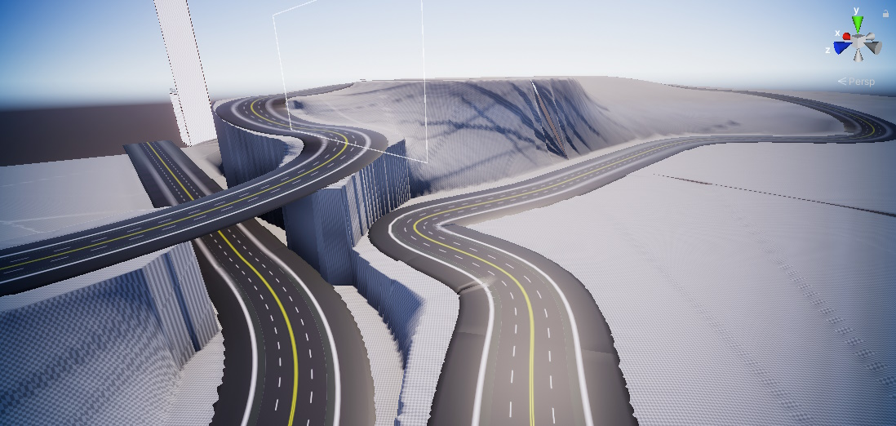

# Terrain Generator
The terrain generator tool helps generate a smooth terrain that is flush with your track models/colliders. This should be used as a starting point since the resulting terrain has rough edges, and adjacent tiles do not necessarily line up correctly. However, the Unity terrain `Smooth Height` tool can quickly fix this, so at a minimum, run the smoothing tool over the resulting terrain.

## Instructions
1. Add your track models to the Unity scene.
1. Apply colliders for the track.
    1. **IMPORTANT**: If colliders are not added, the script will not work since the raycasts used to determine the terrain height will not collide with anything.
1. Add a `Terrain` object to your scene and position it under your track.
    1. GameObject -> 3D Object -> Terrain
1. Add the [TMK_TerrainGenerator.cs](./TMK_TerrainGenerator.cs) script to your terrain.
    1. Do **NOT** add the [TMK_TerrainGeneratorEditor.cs](./TMK_TerrainGeneratorEditor.cs) script.
1. Adjust the terrain generation parameters.
    1. `Raycast From Above`: When this is set to true, the raycasts used to get the initial height will be performed from the maximum terrain height position. When this is false, they are performed from the bottom.
    1. `Path Height Multiplier`: The path height determined by the raycasts will be multiplied by this value. If the terrain clips into the road, set this to a value less than 1.
    1. `Path Margins`: The size of the terrain margins that are level with the road on each side of the track.
    1. `Path Margins Height Multiplier`: The path height of the margins will be multiplied by this value. If there are gaps between the terrain and your track, setting this to a value slightly above 1 can help cover them.
1. Press the `Generate Terrain` button.
    1. **WARNING**: This is a destructive action, and any changes made previously to your terrain **will be lost**!
1. Adjust the parameters and regenerate the terrain, or move on to polishing the resulting terrain with the standard Unity terrain tools.
